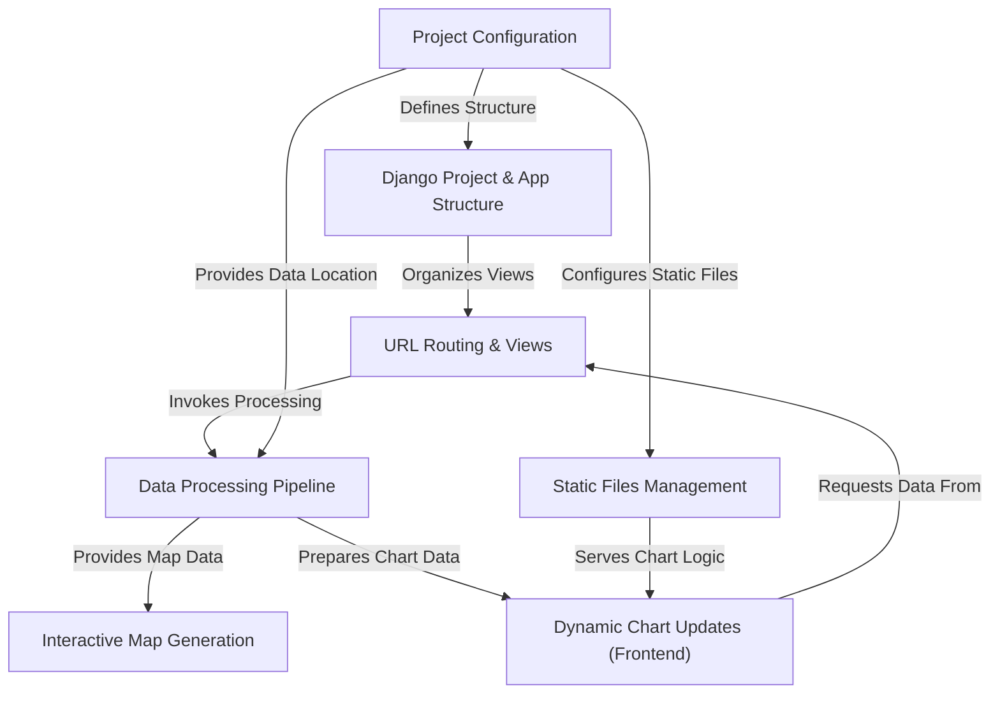
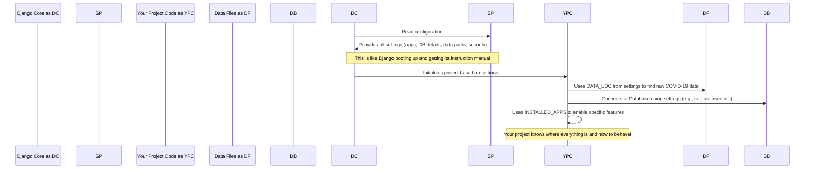
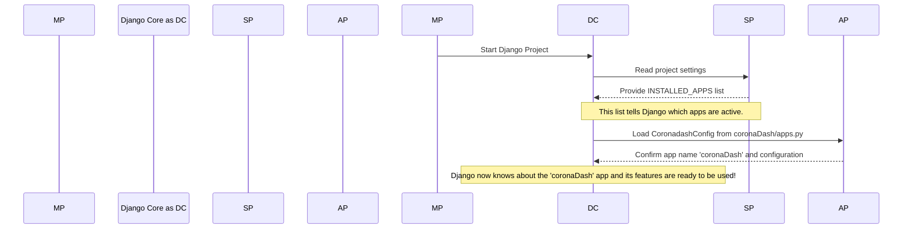
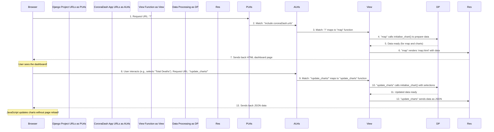
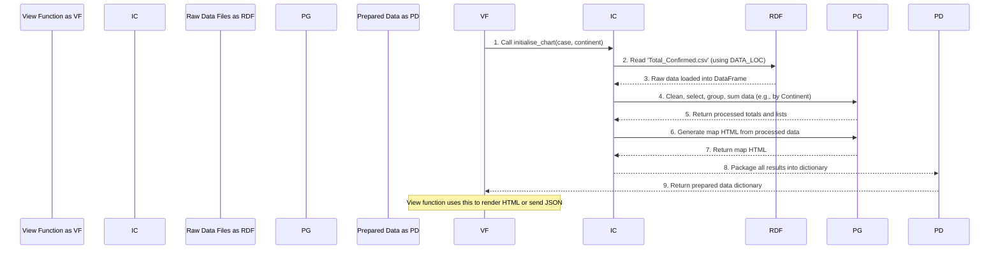
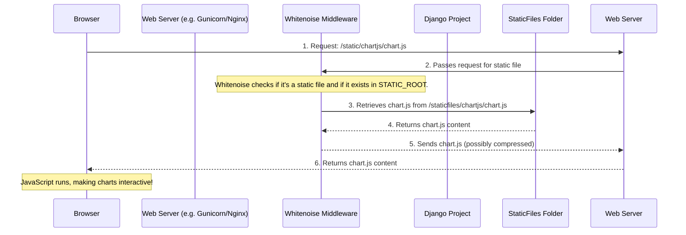
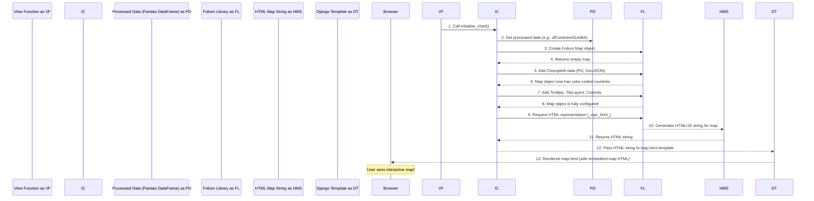
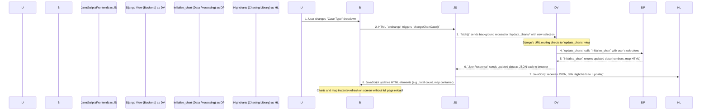

# Tutorial: covid-19-dashboard

This project is a **web-based dashboard** designed to *visualize COVID-19 data* dynamically. It utilizes the Django framework to structure the application and manage web requests. Python libraries are employed to process raw data into usable formats, which are then rendered as *interactive maps* displaying country-level statistics and *dynamic charts* that update in real-time based on user selections.


## Visual Overview



## Chapters

1. [Project Configuration
](01_project_configuration_.md)
2. [Django Project & App Structure
](02_django_project___app_structure_.md)
3. [URL Routing & Views
](03_url_routing___views_.md)
4. [Data Processing Pipeline
](04_data_processing_pipeline_.md)
5. [Static Files Management
](05_static_files_management_.md)
6. [Interactive Map Generation
](06_interactive_map_generation_.md)
7. [Dynamic Chart Updates (Frontend)
](07_dynamic_chart_updates__frontend__.md)

---

# Chapter 1: Project Configuration

Welcome to the first chapter of our journey into understanding the `covid-19-dashboard` project! If you're new to web development or Django, don't worry – we'll take it step by step.

Imagine building a complex machine, like a car. Before you can even start the engine, you need to know how all its parts are connected, what kind of fuel it uses, and where all the essential components (like the engine or the wheels) are located. Without this information, the car wouldn't know how to run!

Our `covid-19-dashboard` project is similar. It's a web application, and just like a car, it needs a central control panel that tells it *how* to operate. This "control panel" is what we call **Project Configuration**.

### What is Project Configuration?

In simple terms, Project Configuration is like the **brain of our Django project**. It holds all the essential rules, settings, and locations that the project needs to function correctly. Think of it as a master blueprint that dictates everything from where to store data to which parts (or "apps") are included in our dashboard.

For our COVID-19 dashboard, a key question is: **"Where are the actual COVID-19 data files stored?"** Without knowing this, our dashboard wouldn't be able to display any information! This is a perfect example of a problem that Project Configuration solves.

### The Brain of the Project: `settings.py`

In a Django project, most of these crucial settings are found in a file called `settings.py`. You'll find this file inside your main project folder, specifically `covid19Dash/settings.py`. Let's take a look at some important parts of this file.

#### Finding Our Way: `BASE_DIR` and `DATA_LOC`

First, Django needs to know where your project lives on your computer. It uses something called `BASE_DIR` (short for "Base Directory") for this. Then, using `BASE_DIR`, we can tell Django where our important data files are.

Here's how it looks in `settings.py`:

```python
# covid19Dash/settings.py
import os
from pathlib import Path
from decouple import config

# Build paths inside the project like this: BASE_DIR / 'subdir'.
BASE_DIR = Path(__file__).resolve().parent.parent
DATA_LOC = BASE_DIR / config('DATA_LOC')
```

**What's happening here?**

*   `BASE_DIR` is a clever line of code that automatically figures out the main folder of your Django project. It's like finding the "home base" for everything.
*   `DATA_LOC` is a special setting we've added! It tells our project exactly where the COVID-19 data files are located. We use `BASE_DIR` as a starting point, and then we add `config('DATA_LOC')`. This `config` part usually pulls the actual folder name from another file (like `.env`) so we don't hardcode it directly. This makes it flexible!

So, thanks to `DATA_LOC`, our dashboard knows exactly where to go to get the raw data it needs to display graphs and maps. This solves our initial problem!

#### Security and Development: `SECRET_KEY` and `DEBUG`

These are two very important settings:

```python
# covid19Dash/settings.py

# SECURITY WARNING: keep the secret key used in production secret!
SECRET_KEY = os.environ.get("SECRET_KEY", config('SECRET_KEY'))

# SECURITY WARNING: don't run with debug turned on in production!
DEBUG = os.environ.get("DEBUG", config('DEBUG'))
```

*   `SECRET_KEY`: This is a unique, secret string of characters. Django uses it for security purposes, like protecting user sessions. It's super important to keep this secret, especially in a live (production) environment!
*   `DEBUG`: This setting controls whether your project is in "development mode" (`True`) or "production mode" (`False`). When `DEBUG` is `True`, Django shows detailed error messages, which is great for finding problems while you're building the project. But for a live website, you want `DEBUG` to be `False` to prevent sensitive information from being exposed.

#### Where Our Website Can Be Accessed: `ALLOWED_HOSTS`

This setting defines a list of domain names or IP addresses where your Django project can be accessed.

```python
# covid19Dash/settings.py
ALLOWED_HOSTS = ['127.0.0.1', 'localhost', ".onrender.com"]
```

*   `'127.0.0.1'` and `'localhost'` are common addresses for running a website on your own computer.
*   `".onrender.com"` is an example of a domain where this project might be hosted live on the internet. This setting helps prevent certain types of attacks.

#### Which Apps Are Part of Our Project: `INSTALLED_APPS`

A Django project is often made up of several smaller, reusable pieces called "apps." Our `covid-19-dashboard` project includes its own custom app for the dashboard features.

```python
# covid19Dash/settings.py
INSTALLED_APPS = [
    'django.contrib.admin',
    'django.contrib.auth',
    # ... other built-in Django apps ...
    'django.contrib.staticfiles',
    'coronaDash.apps.CoronadashConfig' # Our custom app!
]
```

*   This list tells Django which applications are active in your project.
*   You'll see many built-in Django apps (`django.contrib.admin`, `django.contrib.auth`, etc.) that provide core functionalities like user management and an administration panel.
*   Crucially, `'coronaDash.apps.CoronadashConfig'` is our very own app that contains all the specific code for our COVID-19 dashboard features! By adding it here, we tell Django, "Hey, this `coronaDash` thing is part of our project!"

#### Connecting to Data Storage: `DATABASES`

Almost every web application needs a database to store information. The `DATABASES` setting tells Django how to connect to one.

```python
# covid19Dash/settings.py
DATABASES = {
    'default': {
        'ENGINE': 'django.db.backends.sqlite3',
        'NAME': BASE_DIR / 'db.sqlite3',
    }
}
```

*   This snippet sets up a default database connection.
*   `'ENGINE': 'django.db.backends.sqlite3'` means we're using SQLite, which is a lightweight database often used for development because it stores data in a simple file.
*   `'NAME': BASE_DIR / 'db.sqlite3'` tells Django that the database file will be named `db.sqlite3` and will be located right in your project's main folder.

#### Managing Website Assets: `STATIC_URL` and `STATIC_ROOT`

Websites use "static files" like CSS (for styling), JavaScript (for interactivity), and images. These settings help Django find and serve them. We'll dive much deeper into this in [Static Files Management](05_static_files_management_.md), but for now, just know that `settings.py` points the way!

```python
# covid19Dash/settings.py
STATIC_URL = 'static/'
STATIC_ROOT = 'staticfiles'

STATICFILES_STORAGE = 'whitenoise.storage.CompressedManifestStaticFilesStorage'
STATICFILES_DIRS = [
    os.path.join(BASE_DIR, 'static')
]
```

*   `STATIC_URL` is the web address path for static files.
*   `STATIC_ROOT` is where Django will collect all static files when preparing the project for deployment.
*   `STATICFILES_DIRS` lists additional places where Django should look for static files within your project.

### How Does it All Work Under the Hood?

When you start your Django project, it needs to get its instructions. Here's a simplified look at what happens:



As you can see, `settings.py` is the very first thing Django looks at. It's the central hub that provides all the necessary information for the entire project to operate.

For example, when you run commands like `python manage.py migrate` (which sets up your database based on your project's structure), Django refers to the `DATABASES` setting in `settings.py` to know which database to use and where it's located. The `build.sh` script, which is used to set up the project (especially in production), explicitly runs `python manage.py migrate`:

```bash
# build.sh
#!/usr/bin/env bash
# exit on error
set -o errexit

pip install -r requirements.txt

python manage.py collectstatic --no-input
python manage.py migrate # This uses database settings from settings.py!
```

This short script shows that our settings are used even during the setup process. `collectstatic` uses the static file settings, and `migrate` uses the database settings.

### Conclusion

In this chapter, we've learned that **Project Configuration**, mainly handled by the `settings.py` file, is the essential brain of our `covid-19-dashboard` project. It defines crucial aspects like where our data files (`DATA_LOC`) are located, how our project stays secure, which parts (`INSTALLED_APPS`) are active, and how it connects to a database. Understanding `settings.py` is key to knowing how the entire dashboard operates.

Now that we understand how the project is configured, let's move on to explore how it's organized into a [Django Project & App Structure](02_django_project___app_structure_.md).

---

<sub><sup>**References**: [[1]](https://github.com/jessyie/covid-19-dashboard/blob/30c68edb71fc6d398fb251d4c3e32c129bc2eb5e/build.sh), [[2]](https://github.com/jessyie/covid-19-dashboard/blob/30c68edb71fc6d398fb251d4c3e32c129bc2eb5e/covid19Dash/settings.py)</sup></sub>

# Chapter 2: Django Project & App Structure

Welcome back! In [Chapter 1: Project Configuration](01_project_configuration_.md), we learned that `settings.py` is the central brain of our `covid-19-dashboard` project, telling it how to operate and where to find important things like data. Now, imagine that our project's brain needs to perform many different tasks – like displaying a map, showing charts, or managing user accounts. If we put *all* the code for *all* these tasks into one giant file, it would quickly become a confusing mess!

This is where Django's "Project & App Structure" comes in. It helps us keep our code organized and tidy.

### What Problem Does This Structure Solve?

Think of our `covid-19-dashboard` as a large company. A company usually has different departments, right?
*   There's the HR department for people management.
*   There's the Finance department for money.
*   And there might be a specialized "Dashboard Creation Team" that focuses *only* on building and updating the COVID-19 dashboard.

Each department has its own specific job, and they work together under the umbrella of the main company. This structure makes the company efficient and easy to manage, even as it grows.

In Django, we apply the same idea:
*   The **Django Project** is like the entire "company" (`covid19Dash`). It's the overall container that holds everything together and defines the big-picture rules.
*   A **Django App** is like a "specialized department" (`coronaDash`). It's a smaller, self-contained unit that does one specific job very well.

Our `covid-19-dashboard` needs to display various pieces of information – a map, different charts, and perhaps some statistics. Instead of cramming all that code into one place, we create a dedicated **app** called `coronaDash` to handle *all* the dashboard-related features. This keeps our project neat and easy to manage!

### Key Concepts: Project vs. App

Let's break down these two fundamental parts of a Django application.

#### The Django Project: The Overall Company (`covid19Dash`)

A Django Project is the main setup for your entire web application. When you first start a new Django project using the `django-admin startproject` command, it creates the basic structure for you.

For our `covid-19-dashboard` project, the main project folder is named `covid19Dash`. Inside it, you'll find important files and folders:

```
covid-19-dashboard/
├── covid19Dash/          <- This is our main Django project folder
│   ├── __init__.py
│   ├── asgi.py
│   ├── settings.py       <- The "brain" we discussed in Chapter 1
│   ├── urls.py           <- The "main switchboard" for website addresses
│   └── wsgi.py
├── manage.py             <- A useful tool for running Django commands
└── coronaDash/           <- Our specialized Django app (more on this next!)
    └── ... (app files)
```

**What does the Project do?**

*   **Global Settings:** It contains `settings.py`, which defines the overall rules for the entire website (like database connections, security keys, and which other "apps" are active).
*   **Main URL Routing:** It has `urls.py`, which is like the main directory for all the web addresses (URLs) on your site. It directs incoming web requests to the correct "department" (app) to handle them. We'll explore this in [URL Routing & Views](03_url_routing___views_.md).
*   **Command Line Tool:** `manage.py` is a powerful script that lets you run various Django commands, like starting the development server or setting up the database.

Think of the project as the **foundation** upon which all your specific features (apps) are built.

#### The Django App: A Specialized Department (`coronaDash`)

A Django App is a self-contained module that does one specific thing, or a closely related set of things. It's designed to be reusable. For example, if you built a user authentication app, you could potentially use it in many different Django projects!

Our `covid-19-dashboard` has an app named `coronaDash`. This app is responsible for everything related to displaying the COVID-19 data: the map, the charts, and any logic needed to prepare that data.

Let's look at the structure of our `coronaDash` app:

```
covid-19-dashboard/
└── coronaDash/           <- Our Django app folder
    ├── __init__.py
    ├── admin.py
    ├── apps.py           <- Tells Django about this app
    ├── models.py
    ├── tests.py
    ├── urls.py           <- Specific web addresses for this app's features
    └── views.py          <- The "workers" that generate web pages
```

**What does the App do?**

*   **Specific Features:** Contains code for a particular functionality, like our interactive dashboard.
*   **Modularity:** Keeps related code together, making it easier to develop, test, and maintain.
*   **Reusability:** Apps can often be "plugged" into different Django projects.

In our case, the `coronaDash` app is where the actual dashboard magic happens. It will contain the code that fetches the COVID-19 data, processes it, and prepares it to be displayed beautifully on your screen.

### How Does Our Dashboard Use This Structure?

The `covid-19-dashboard` project wisely separates concerns:
1.  The `covid19Dash` project handles the overall setup, like `settings.py` and the main `urls.py` that directs traffic.
2.  The `coronaDash` app contains all the specific logic for building and displaying the dashboard itself.

This means that if we ever wanted to add, say, a "User Profile" feature to our dashboard, we would likely create *another* Django app (e.g., `userProfiles`) for that, instead of mixing its code with the `coronaDash` code. This keeps our "departments" distinct and organized.

### How Does Django Know About Our App?

For Django to know that our `coronaDash` app exists and is part of the `covid19Dash` project, we need to "register" it. This happens in the `INSTALLED_APPS` list within the main project's `settings.py` file.

In [Chapter 1](01_project_configuration_.md), we briefly saw this line:

```python
# covid19Dash/settings.py (simplified)

INSTALLED_APPS = [
    # ... built-in Django apps ...
    'coronaDash.apps.CoronadashConfig' # Our custom app!
]
```

This line tells Django, "Hey, there's an app named `coronaDash`, and its main configuration is defined in `coronaDash/apps.py` inside the `CoronadashConfig` class. Please include it in our project!"

Let's look at what's inside `coronaDash/apps.py`:

```python
# coronaDash/apps.py
from django.apps import AppConfig

class CoronadashConfig(AppConfig):
    default_auto_field = 'django.db.models.BigAutoField'
    name = 'coronaDash' # This is the app's name!
```

This simple file tells Django the official name of our app (`'coronaDash'`) and some default settings. When Django reads `settings.py` and sees `'coronaDash.apps.CoronadashConfig'`, it goes to this file to get the app's details.

### How It All Works Under the Hood

When you start your Django project (for example, by running `python manage.py runserver`), Django goes through a specific process to understand which apps are part of your project.

Here's a simplified look at what happens:



As you can see, `settings.py` acts as the directory that points Django towards all the active apps, and each app's `apps.py` file provides the necessary details for Django to properly load it.

### Project vs. App: A Quick Comparison

| Feature         | Django Project (`covid19Dash`)                  | Django App (`coronaDash`)                               |
| :-------------- | :---------------------------------------------- | :------------------------------------------------------ |
| **Analogy**     | The whole company                               | A specialized department within the company             |
| **Purpose**     | Overall container, global settings, main URLs   | Specific feature (e.g., dashboard, user management)     |
| **Creation**    | `django-admin startproject`                     | `python manage.py startapp`                             |
| **Key Files**   | `settings.py`, `urls.py` (main), `manage.py`    | `views.py`, `models.py`, `urls.py` (app-specific), `apps.py` |
| **Reusability** | Usually unique to one website                   | Can often be reused across different Django projects    |
| **Dependency**  | Apps are part of a project, not vice-versa      | Project needs to "install" apps in `settings.py`        |

### Conclusion

In this chapter, we've explored the fundamental building blocks of a Django application: the **Project** and the **App**. We learned that the `covid19Dash` is our overall Django Project, acting like a company, while `coronaDash` is a specific app within it, functioning as a specialized department responsible for displaying the COVID-19 dashboard. This structure, facilitated by `settings.py` and each app's `apps.py`, keeps our code organized, maintainable, and scalable.

Now that we understand how our project and apps are structured, the next logical step is to see how web requests actually find their way through this structure to display content. In the next chapter, we'll dive into [URL Routing & Views](03_url_routing___views_.md).

---

<sub><sup>**References**: [[1]](https://github.com/jessyie/covid-19-dashboard/blob/30c68edb71fc6d398fb251d4c3e32c129bc2eb5e/coronaDash/__init__.py), [[2]](https://github.com/jessyie/covid-19-dashboard/blob/30c68edb71fc6d398fb251d4c3e32c129bc2eb5e/coronaDash/apps.py), [[3]](https://github.com/jessyie/covid-19-dashboard/blob/30c68edb71fc6d398fb251d4c3e32c129bc2eb5e/covid19Dash/__init__.py), [[4]](https://github.com/jessyie/covid-19-dashboard/blob/30c68edb71fc6d398fb251d4c3e32c129bc2eb5e/covid19Dash/asgi.py), [[5]](https://github.com/jessyie/covid-19-dashboard/blob/30c68edb71fc6d398fb251d4c3e32c129bc2eb5e/covid19Dash/settings.py), [[6]](https://github.com/jessyie/covid-19-dashboard/blob/30c68edb71fc6d398fb251d4c3e32c129bc2eb5e/covid19Dash/urls.py), [[7]](https://github.com/jessyie/covid-19-dashboard/blob/30c68edb71fc6d398fb251d4c3e32c129bc2eb5e/covid19Dash/wsgi.py), [[8]](https://github.com/jessyie/covid-19-dashboard/blob/30c68edb71fc6d398fb251d4c3e32c129bc2eb5e/manage.py)</sup></sub>

# Chapter 3: URL Routing & Views

Welcome back, future web developer! In [Chapter 2: Django Project & App Structure](02_django_project___app_structure_.md), we learned how our `covid-19-dashboard` project is neatly organized into a main project (`covid19Dash`) and a specialized app (`coronaDash`). This structure helps us keep our code tidy, like different departments in a company.

But how does a user actually *interact* with our dashboard? If someone types `https://your-dashboard.com` into their web browser, how does Django know to show them the interactive map and charts? This is where **URL Routing & Views** come into play!

### What Problem Does This Solve?

Imagine you want to order food from a new restaurant. You look up their website, maybe `www.tasty-tacos.com`. When you type that address, you expect to see their menu, right? You don't want to see their accounting books or their hiring forms!

Similarly, in a web application, when a user types a web address (a **URL**), the website needs to know exactly **what information to show** and **what code to run** to prepare that information.

For our `covid-19-dashboard`, we have two main things we want to do:
1.  When someone visits the main page (like `https://your-dashboard.com/`), we want to display the interactive COVID-19 map and initial charts.
2.  When someone interacts with the dashboard (e.g., changes a filter for "Total Deaths" or selects "Africa"), we need to update the charts dynamically without reloading the whole page. This means sending a special request to another address, like `https://your-dashboard.com/update_charts/`.

**URL Routing & Views** provide the solution. They act like a **traffic controller** for your website, directing incoming web requests (URLs) to the right piece of Python code that knows how to handle them.

### Key Concepts

Let's break down the essential pieces that make this traffic control system work:

#### 1. The URL (Uniform Resource Locator)

This is simply the web address you type into your browser, like `https://www.google.com` or `https://your-dashboard.com/update_charts/`. It's the unique "street address" for a specific piece of content or functionality on the web.

#### 2. The URL Router (or URLconf)

Think of this as the **main switchboard** or **GPS system** of your Django project. When a request comes in, the URL router looks at the URL and tries to match it to a list of predefined patterns. If it finds a match, it knows exactly which Python function to call to handle that request.

In Django, these patterns and their associated functions are defined in files called `urls.py`. You'll typically find one in your main project folder and others inside your individual apps.

#### 3. The View Function

If the URL router is the traffic controller, then a **view function** is the **specialist worker** who actually *does* the job. Once the URL router directs a request to a view function, that function:
*   Receives the request (which might contain information like what filters the user selected).
*   Does some work (like fetching data, processing it, or interacting with a database).
*   Decides what to send back to the user's browser (e.g., an HTML page, a piece of JSON data, or a file).

In our `covid-19-dashboard`, the view functions are found in `coronaDash/views.py`.

#### 4. The Request and Response Cycle

Every time you interact with a website, a **request-response cycle** happens:
1.  **Request:** Your browser sends a "request" to the web server (e.g., "Please give me the page at `/`").
2.  **Django Processing:** Django receives the request, the URL router finds the right view function.
3.  **View Function Work:** The view function does its job.
4.  **Response:** The view function sends back a "response" (e.g., the HTML content for the dashboard page, or just some data in JSON format for the charts).
5.  **Browser Display:** Your browser receives the response and displays it.

### How it Works in Our `covid-19-dashboard`

Let's see how these pieces come together for our COVID-19 dashboard.

#### Step 1: The Main Switchboard (`covid19Dash/urls.py`)

Every Django project has a main `urls.py` file. For our project, it's `covid19Dash/urls.py`. This file is the *first* place Django looks when a request comes in. It's like the main phone directory for the whole company.

Here's a simplified look at `covid19Dash/urls.py`:

```python
# covid19Dash/urls.py
from django.contrib import admin
from django.urls import path, include

urlpatterns = [
    # When someone visits the root URL (e.g., '/'), go to 'coronaDash.urls'
    path('', include('coronaDash.urls')),
    # For the admin panel, use its specific URL patterns
    path('to-secret-admin/', admin.site.urls),
]
```

**What's happening here?**
*   `urlpatterns` is a list of URL patterns.
*   `path('', include('coronaDash.urls'))`: This line is super important! It says: "If the URL is empty (meaning the main page, like `https://your-dashboard.com/`), then don't handle it directly here. Instead, **include** all the URL patterns defined inside our `coronaDash` app's `urls.py` file."
*   `include()` is like telling the main switchboard to transfer the call to a specific department's own internal directory. This keeps our main `urls.py` clean and delegates specific URL handling to the responsible app.

#### Step 2: The App's Specific Routes (`coronaDash/urls.py`)

Now, Django follows the instruction from the main `urls.py` and looks into `coronaDash/urls.py`. This file contains the URL patterns specific to our dashboard app. It's the "department directory" for the dashboard features.

```python
# coronaDash/urls.py
from django.urls import path
from . import views # Import our view functions from views.py

urlpatterns = [
    # When someone visits '/', use the 'map' view function
    path('', views.map, name='map'),
    # When someone visits '/update_charts/', use the 'update_charts' view function
    path('update_charts/', views.update_charts, name='update_charts'),
]
```

**What's happening here?**
*   `from . import views`: This line imports our "worker" functions from the `views.py` file located in the *same* `coronaDash` folder.
*   `path('', views.map, name='map')`: This defines what happens for the main dashboard page.
    *   `''`: This is an empty string, meaning it matches the *root* of what the `covid19Dash/urls.py` passed to it (which was the overall root `/`). So, `''` here means `https://your-dashboard.com/`.
    *   `views.map`: When this URL is matched, Django calls the `map` function found inside `coronaDash/views.py`.
    *   `name='map'`: This gives a convenient name to this URL pattern. We can use this name later in our code to refer to this URL without typing out the full path, making our code more flexible.
*   `path('update_charts/', views.update_charts, name='update_charts')`: This defines the URL for updating charts dynamically.
    *   `'update_charts/'`: This means `https://your-dashboard.com/update_charts/`.
    *   `views.update_charts`: When this URL is matched, Django calls the `update_charts` function in `coronaDash/views.py`.

#### Step 3: The View Functions (`coronaDash/views.py`)

Finally, after the URL router directs the request, the specific view function springs into action. These functions are the heart of our dashboard's backend.

Let's look at the `map` and `update_charts` view functions:

```python
# coronaDash/views.py (simplified)
from django.shortcuts import render
from django.http import JsonResponse
# ... other imports for data processing ...
from django.conf import settings

# This function prepares all the data needed for charts and maps
def initialise_chart(case = 'Total_Confirmed', continent = 'Africa'):
    # ... lots of data processing, map generation, etc. (covered in Chapter 4) ...
    # It returns a dictionary of data for the template or JSON response
    context = {
        'tSum' : 12345, # Example data
        'graph1AX' : ['Continent1', 'Continent2'], # Example data
        # ... other data for charts and maps ...
        'world_map' : '<!-- HTML for map -->', # Example HTML for map
    }
    return context

# This view function handles requests to the main dashboard page ('/')
def map(request):
    # Call initialise_chart to get the initial data for the dashboard
    data = initialise_chart()
    # Render the 'map.html' template, passing the prepared data to it
    return render(request, 'map.html', data)

# This view function handles requests to '/update_charts/'
def update_charts(request):
    # Get the selected case (e.g., 'Total_Confirmed') and continent from the request
    selected_case = request.GET.get("case")
    selected_continent = request.GET.get("continent")

    # Prepare updated data based on the user's selection
    data = initialise_chart(selected_case, selected_continent)
        
    # Send the data back as a JSON response (for dynamic updates on the page)
    return JsonResponse(data)
```

**What's happening here?**
*   **`map(request)`:**
    *   This function is called when a user visits the main page (`/`).
    *   It calls `initialise_chart()` (which does all the heavy lifting of preparing the COVID-19 data and maps – we'll learn more about this in [Chapter 4: Data Processing Pipeline](04_data_processing_pipeline_.md)).
    *   `render(request, 'map.html', data)`: This is Django's way of saying, "Take the `map.html` file (which is our web page template), fill it with the `data` we just prepared, and send the resulting HTML back to the user's browser."
*   **`update_charts(request)`:**
    *   This function is called when the frontend (JavaScript) makes a request to `/update_charts/`, typically when a user changes a filter.
    *   `request.GET.get("case")` and `request.GET.get("continent")`: These lines retrieve information sent from the browser (e.g., "the user selected 'Total_Deaths' and 'Asia'").
    *   It then calls `initialise_chart()` again, but this time, it passes the user's `selected_case` and `selected_continent` to get updated data.
    *   `JsonResponse(data)`: Instead of sending back a whole HTML page, this function sends back just the `data` (which is a Python dictionary) formatted as **JSON**. JSON is a standard way to exchange data between a web server and a web page, perfect for dynamic updates without reloading the entire page.

### How it All Works Under the Hood

Let's put it all together in a sequence:



This sequence shows the complete journey of a web request through Django's URL routing and view system. The URL router directs traffic, and the view functions perform the necessary work to generate the content.

### Conclusion

In this chapter, we've demystified how web requests are handled in our `covid-19-dashboard`. We learned that **URL Routing** (defined in `urls.py` files in both the project and the app) acts as the traffic controller, matching incoming URLs to specific **View Functions** (defined in `views.py`). These view functions then do the heavy lifting of preparing data and generating responses, whether it's a full HTML page for the initial load or just dynamic JSON data for updates.

Understanding URL routing and views is crucial because it's the bridge between what a user types in their browser and the Python code that makes our dashboard work.

Next, we'll dive deeper into the `initialise_chart` function and other data handling in [Chapter 4: Data Processing Pipeline](04_data_processing_pipeline_.md).

---

<sub><sup>**References**: [[1]](https://github.com/jessyie/covid-19-dashboard/blob/30c68edb71fc6d398fb251d4c3e32c129bc2eb5e/coronaDash/urls.py), [[2]](https://github.com/jessyie/covid-19-dashboard/blob/30c68edb71fc6d398fb251d4c3e32c129bc2eb5e/coronaDash/views.py), [[3]](https://github.com/jessyie/covid-19-dashboard/blob/30c68edb71fc6d398fb251d4c3e32c129bc2eb5e/covid19Dash/urls.py)</sup></sub>

# Chapter 4: Data Processing Pipeline

Welcome back! In [Chapter 3: URL Routing & Views](03_url_routing___views_.md), we learned how Django acts like a traffic controller, directing web requests (URLs) to the correct "view functions" in our `coronaDash/views.py` file. These view functions are responsible for preparing the information a user sees.

But what *kind* of information do they prepare for our `covid-19-dashboard`? And where does that information come from?

### What Problem Does This Solve?

Imagine you're making a delicious meal. You don't just dump raw ingredients (like uncooked chicken, whole vegetables, and flour) onto a plate and serve them, right? You need to:
1.  **Get the ingredients:** Go to the pantry or fridge.
2.  **Clean and chop:** Wash vegetables, cut chicken into pieces.
3.  **Cook:** Sauté, bake, boil, and combine ingredients.
4.  **Serve:** Arrange the finished dish nicely on a plate.

Our `covid-19-dashboard` is similar! It needs to display things like "Total Confirmed Cases by Continent" or an interactive map showing cases by country. The original COVID-19 data comes in very raw forms, like large spreadsheet files (CSVs) or special geographical files (GeoJSONs). These files aren't immediately ready for display.

This is where the **Data Processing Pipeline** comes in. It's the "kitchen" of our dashboard, where raw COVID-19 data is transformed into usable, summarized information that can be displayed on charts and maps. Without this pipeline, our dashboard would be just an empty plate!

### What is the Data Processing Pipeline?

The Data Processing Pipeline is a series of steps that takes our raw data files and turns them into something useful for our dashboard. It involves:
1.  **Reading the raw data:** Opening files like `Total_Confirmed.csv`.
2.  **Cleaning and organizing:** Making sure numbers are actually numbers, selecting only the columns we need.
3.  **Calculating and summarizing:** Grouping data (e.g., by continent or country) and calculating totals or other statistics.
4.  **Preparing for display:** Arranging the processed data into a structured format that our charts and maps can easily understand.

We use powerful Python libraries like `pandas` (great for working with tables of data) and `geopandas` (which extends `pandas` to also handle geographical data) to perform these steps.

### The Raw Ingredients: Our Data Files

First, our kitchen needs ingredients! As we saw in [Chapter 1: Project Configuration](01_project_configuration_.md), we've configured our project to know exactly where these raw data files are located using the `DATA_LOC` setting in `settings.py`.

The `initialise_chart` function, which is our main "chef," uses this setting to find the data:

```python
# coronaDash/views.py (snippet)
from django.conf import settings
import os # To join file paths
import pandas as pd # To work with data tables
import geopandas as gpd # To work with geographical data

# Convert WindowsPath object to string
data_loc_str = str(settings.DATA_LOC)

def initialise_chart(case = 'Total_Confirmed', continent = 'Africa'):
    # ... code to read and process data ...
    filename = case + '.csv' # e.g., 'Total_Confirmed.csv'
    path = os.path.join(data_loc_str, 'CDATA', filename)
    df = gpd.read_file(path) # Read the data file
    # ... more processing ...
```

*   `settings.DATA_LOC` points to the folder where our COVID-19 data is kept.
*   The `initialise_chart` function builds the full path to the specific CSV file it needs (e.g., `Total_Confirmed.csv`, `Total_Deaths.csv`).
*   `gpd.read_file(path)` is like opening the raw ingredient package (our CSV file) and loading all its contents into a `DataFrame`, which is like a super-powered spreadsheet in Python.

### The Kitchen Chef: `initialise_chart` Function

The `initialise_chart` function in `coronaDash/views.py` is the heart of our data processing pipeline. It takes two main "orders" from the user (via the `update_charts` view function):
*   `case`: What kind of data to show (e.g., 'Total_Confirmed', 'Total_Deaths').
*   `continent`: Which continent to focus on (e.g., 'Africa', 'Asia').

Let's break down how this function prepares our data meal:

#### Step 1: Getting the Raw Ingredients (Reading Data)

As seen above, the first thing is to read the correct CSV file based on the `case` selected:

```python
# coronaDash/views.py (inside initialise_chart, simplified)
# ... imports and data_loc_str setup ...

def initialise_chart(case = 'Total_Confirmed', continent = 'Africa'):
    # 1. Get the right CSV file based on 'case'
    filename = case + '.csv' # Example: 'Total_Confirmed.csv'
    path = os.path.join(data_loc_str, 'CDATA', filename)
    df = gpd.read_file(path) # Load the data into a DataFrame
    
    # Example raw data (what 'df' might look like initially):
    # Continent,Country,Total
    # Africa,South Africa,1234567
    # Africa,Egypt,543210
    # Asia,India,9876543
    # ...
```
This step is like bringing the correct bag of raw vegetables into the kitchen. The `df` variable now holds all the data from the chosen CSV file.

#### Step 2: Cleaning and Chopping (Selecting and Converting Data)

Our raw data might have columns we don't need, or numbers might be stored as text. We need to "clean and chop" them to make them ready for calculations.

```python
# coronaDash/views.py (inside initialise_chart, simplified)
# ... df is loaded from Step 1 ...

    # 2. Select relevant columns and convert 'Total' column to numbers
    # We want 'Continent' and 'Total' for overall summaries
    dfGroupA = df[["Continent", "Total"]] 
    # The 'Total' column might be text with commas, so convert to integers
    dfGroupA["Total"] = dfGroupA["Total"].astype('int') 
    
    # If a specific continent is selected, we "chop" the data further
    grouped_by_continent = df.groupby(['Continent'])
    dfGroup = grouped_by_continent.get_group(continent) # e.g., get only 'Africa' data
    
    # Similar cleaning for country-specific data
    dfGroupB = dfGroup[["Country", "Total"]]
    dfGroupB["Total"] = dfGroupB["Total"].astype('int')
    
    # After this step, our data is clean and ready for calculations!
    # dfGroupA: | Continent | Total |
    #           | Africa    | 1234567 |
    #           | Africa    | 543210 |
    #           | Asia      | 9876543 |
    # ...
    # dfGroup (if continent='Africa'):
    # Continent,Country,Total
    # Africa,South Africa,1234567
    # Africa,Egypt,543210
    # ...
```
Here, we create new temporary "trays" of data (`dfGroupA`, `dfGroupB`) containing only the columns we need. The `.astype('int')` part is crucial: it ensures that the 'Total' column, which might be read as text from the CSV, is converted into actual numbers so we can perform mathematical operations like summing.

#### Step 3: Cooking and Combining (Grouping and Summing)

Now that our ingredients are clean, it's time to "cook" them by grouping and summarizing. We want to find the total cases per continent or per country.

```python
# coronaDash/views.py (inside initialise_chart, simplified)
# ... dfGroupA, dfGroupB are prepared from Step 2 ...

    # 3. Cook the data: Group by Continent and sum totals
    dfContinentSum = dfGroupA.groupby(by=["Continent"])["Total"].sum().reset_index()
    # This results in:
    # | Continent | Total   |
    # | Africa    | 1777777 | (sum of all African countries)
    # | Asia      | 9876543 | (sum of all Asian countries)
    # ...
    
    # Get the continent names and their sums as lists for charts
    graph1AX = dfContinentSum['Continent'].values.tolist() # ['Africa', 'Asia', ...]
    graph1AY = dfContinentSum['Total'].values.astype(int).tolist() # [1777777, 9876543, ...]

    # Cook the data for selected continent's countries
    dfContinentSumB = dfGroupB.groupby(by=["Country"])["Total"].sum().reset_index()
    # If continent was 'Africa', this might result in:
    # | Country      | Total   |
    # | South Africa | 1234567 |
    # | Egypt        | 543210  |
    # ...
    
    graph1BX = dfContinentSumB['Country'].values.tolist()
    graph1BY = dfContinentSumB['Total'].values.astype(int).tolist()
    
    # Calculate the grand total
    tSum = dfGroupA["Total"].values.sum().astype(int).tolist() # Total cases worldwide
```
The `groupby()` and `sum()` functions are incredibly powerful. They allow us to quickly calculate totals for different categories (like continents or countries), just like summing up all the costs for different departments in a company.

#### Step 4: Serving the Meal (Packaging the Output)

Finally, all the processed data (the "cooked meals") need to be neatly packaged into a Python dictionary. This dictionary is then passed back to the view function, which uses it to either fill an HTML template or send it as JSON data.

```python
# coronaDash/views.py (inside initialise_chart, simplified)
# ... all data (tSum, graph1AX, graph1AY, etc.) is prepared ...
# ... map generation using folium also happens here, result stored in world_map ...

    # 4. Package all the processed data into a dictionary
    context = {
        'tSum' : tSum, # Global total
        'graph1AX' : graph1AX, # List of continents
        'graph1AY' : graph1AY, # List of totals per continent
        'graph1BX' : graph1BX, # List of countries (for selected continent)
        'graph1BY' : graph1BY, # List of totals per country
        'world_map' : world_map, # HTML for the interactive map
        'world_map2' : world_map2 # HTML for another map
    }
    return context
```
This `context` dictionary is the finished meal ready to be served! The `world_map` and `world_map2` are generated using the `folium` library, which takes processed geographical data and turns it into interactive HTML maps. We'll explore map generation in more detail in [Chapter 6: Interactive Map Generation](06_interactive_map_generation_.md).

### How it Works Under the Hood

Let's see the journey of data through our pipeline within the context of a user request:



When the `map` view function (from [Chapter 3](03_url_routing___views_.md)) needs to display the initial dashboard, or when `update_charts` needs to refresh content, they call `initialise_chart`. This function then orchestrates the entire data processing, from reading the raw file to calculating summaries and even generating the maps. The processed data is then handed back to the view, ready for the frontend.

### Conclusion

In this chapter, we've uncovered the **Data Processing Pipeline**, the unsung hero that turns raw COVID-19 data into meaningful insights for our dashboard. We learned that the `initialise_chart` function acts as our "data kitchen chef," using powerful tools like `pandas` and `geopandas` to read, clean, group, calculate, and finally package the data into a usable format. This pipeline is essential for presenting clear, summarized information on our charts and maps.

Now that we understand how our data is prepared, let's move on to how our website uses external resources like CSS, JavaScript, and images to look good. Next, we'll explore [Static Files Management](05_static_files_management_.md).

---

<sub><sup>**References**: [[1]](https://github.com/jessyie/covid-19-dashboard/blob/30c68edb71fc6d398fb251d4c3e32c129bc2eb5e/coronaDash/views.py), [[2]](https://github.com/jessyie/covid-19-dashboard/blob/30c68edb71fc6d398fb251d4c3e32c129bc2eb5e/covid19Dash/settings.py)</sup></sub>

# Chapter 5: Static Files Management

Welcome back! In [Chapter 4: Data Processing Pipeline](04_data_processing_pipeline_.md), we learned how our dashboard's "kitchen" (`initialise_chart` function) takes raw COVID-19 data and cooks it into useful summaries and statistics. That's great for the *information* on our dashboard, but what about how the dashboard *looks*?

Imagine building a beautiful house. You need a strong foundation and well-structured rooms (that's our data and logic). But you also need paint on the walls, stylish furniture, and perhaps some lovely curtains to make it truly appealing and comfortable to live in!

Our `covid-19-dashboard` is similar. It needs to display information, but it also needs:
*   **Styles:** To make buttons look nice, organize content with proper spacing, and use readable fonts (this is handled by **CSS** files).
*   **Interactivity:** To make the map zoom, charts respond to clicks, or menus drop down (this is handled by **JavaScript** files).
*   **Images:** Like logos or icons.

These are all **"static files"** because, unlike our COVID-19 data which changes, these files typically stay the same. They are fixed resources that the web browser downloads once to display your page correctly.

### What Problem Does This Solve?

If you simply put your CSS and JavaScript files anywhere, Django wouldn't know where to find them when a user's browser asks for them. Even if it did, imagine having hundreds of static files for different parts of your website – keeping track of them would be a nightmare!

The **Static Files Management** system in Django solves this by providing a well-organized library for all these non-dynamic resources. It tells Django:
1.  **Where to find** CSS, JavaScript, images, etc., in your project.
2.  **How to serve** these files efficiently to the user's web browser.
3.  **How to prepare** these files for a live website (deployment).

Without this system, our dashboard would look like a plain, unstyled webpage, and none of its interactive elements would work!

### Key Concepts: Django's Static Files System

Django has a built-in feature called `django.contrib.staticfiles` that helps manage these files. Here are the main ideas:

#### 1. `STATIC_URL`: The Web Address for Static Files

This is the "nickname" or the web path that browsers will use to request your static files.

```python
# covid19Dash/settings.py
STATIC_URL = 'static/'
```
If your `STATIC_URL` is `static/`, then a CSS file located at `your-project/static/css/style.css` would be accessible in the browser at `https://your-dashboard.com/static/css/style.css`.

#### 2. `STATICFILES_DIRS`: Where You Keep Your Static Files During Development

This is a list of folders where Django should look for static files *inside your apps or project* during development. It's like telling Django, "Hey, when you're running, also check these places for static files."

```python
# covid19Dash/settings.py
import os
from pathlib import Path

BASE_DIR = Path(__file__).resolve().parent.parent # Already explained in Chapter 1
# ... other settings ...

STATICFILES_DIRS = [
    os.path.join(BASE_DIR, 'static') # Look inside 'your-project/static/'
]
```
In our `covid-19-dashboard` project, we have a `static` folder directly under `BASE_DIR` (the main project folder). This is where we keep general static files, like the `bootstrap` library JavaScript (`static/bootstrap/js/bootstrap.bundle.min.js`) or our custom `chart.js` (`static/chartjs/chart.js`).

#### 3. `STATIC_ROOT`: Where All Static Files Are Collected for Deployment

When you prepare your project to go live on the internet, Django needs to gather *all* static files from *all* your apps (and any `STATICFILES_DIRS`) into one single location. `STATIC_ROOT` is that destination folder.

```python
# covid19Dash/settings.py
STATIC_ROOT = 'staticfiles' # Files will be collected here, e.g., 'your-project/staticfiles/'
```
This folder typically isn't used during local development (`DEBUG=True`). Instead, it's used when you deploy your site, making it easier for web servers to find and serve these files.

#### 4. `collectstatic` Command: The Gathering Process

This is a powerful Django command that does the actual gathering of files into `STATIC_ROOT`.

```bash
# Part of build.sh
python manage.py collectstatic --no-input
```
When you run `python manage.py collectstatic`, Django searches `STATICFILES_DIRS` and the `static` folders inside all your `INSTALLED_APPS` (like `coronaDash/static/`). It then copies all these files into the `STATIC_ROOT` directory. This is crucial for performance on a live website, as it centralizes all static assets.

#### 5. Whitenoise: Serving Files Efficiently in Production

On a live website, Django itself isn't usually the best tool for serving static files directly because it's designed for dynamic content. That's where tools like **Whitenoise** come in. Whitenoise is a Python library that helps Django serve static files much more efficiently and reliably, especially in production environments. It can also compress files to make them load faster.

It's configured in `settings.py` through `MIDDLEWARE` and `STATICFILES_STORAGE`:

```python
# covid19Dash/settings.py (snippet)

INSTALLED_APPS = [
    # ...
    'django.contrib.staticfiles', # Essential for static files
    # ...
]

MIDDLEWARE = [
    # ...
    'whitenoise.middleware.WhiteNoiseMiddleware', # Whitenoise intercepts static file requests
    # ...
]

# ...

STATICFILES_STORAGE = 'whitenoise.storage.CompressedManifestStaticFilesStorage'
```
*   Adding `whitenoise.middleware.WhiteNoiseMiddleware` to `MIDDLEWARE` tells Django to let Whitenoise handle static file requests first.
*   `STATICFILES_STORAGE` tells Django to use Whitenoise's storage backend when collecting static files, which can do things like compress them and add unique names (for caching).

### How Our Dashboard Uses Static Files Management

Let's see this in action for our dashboard:

#### 1. Storing Static Files

In our project, you'll find static files in a `static` folder at the root level:

```
covid-19-dashboard/
├── covid19Dash/
└── static/               <- Our main static files folder
    ├── bootstrap/
    │   ├── css/
    │   └── js/
    │       ├── bootstrap.bundle.min.js   <- Example Bootstrap JS file
    │       └── bootstrap.min.js
    └── chartjs/
        └── chart.js                      <- Our custom chart logic
```

We told Django about this `static` folder using `STATICFILES_DIRS` in `covid19Dash/settings.py`:

```python
# covid19Dash/settings.py
STATICFILES_DIRS = [
    os.path.join(BASE_DIR, 'static') # Django will look here!
]
```

#### 2. Using Static Files in Templates (HTML)

When we build our dashboard's HTML pages (`map.html` is our main dashboard page, as seen in [Chapter 3: URL Routing & Views](03_url_routing___views_.md)), we need to tell the browser where to find these CSS and JavaScript files.

Inside an HTML template, Django provides a special tag to help with this: ``.

```html
<!-- coronaDash/templates/map.html (simplified) -->

<!DOCTYPE html>
<html>
<head>
    <title>COVID-19 Dashboard</title>
    <!-- Link to a CSS stylesheet -->
    <link rel="stylesheet" type="text/css" href="">
    <link rel="stylesheet" type="text/css" href="">
</head>
<body>
    <!-- Your dashboard content here -->
    
    <!-- Link to JavaScript files -->
    <script src=""></script>
    <script src=""></script>
</body>
</html>
```
*   ``: This line is always needed at the top of your template to enable the `` tag.
*   `href=""`: When this HTML is sent to the browser, Django replaces `` with the full URL, like `/static/bootstrap/css/bootstrap.min.css`. The browser then knows exactly where to request the file.
*   `src=""`: Similarly, this loads our custom JavaScript file that contains logic for updating charts and maps, as discussed in [Chapter 7: Dynamic Chart Updates (Frontend)](07_dynamic_chart_updates__frontend__.md).

#### 3. Preparing for Deployment (`collectstatic`)

As mentioned, the `build.sh` script (used when deploying the project) runs `python manage.py collectstatic`:

```bash
# build.sh
#!/usr/bin/env bash
# exit on error
set -o errexit

pip install -r requirements.txt

python manage.py collectstatic --no-input # This gathers all static files!
python manage.py migrate
```
This command gathers all the CSS, JS, and image files from `covid-19-dashboard/static/` and any other app-specific `static/` folders and puts them into the `staticfiles` folder (our `STATIC_ROOT`).

For example, after `collectstatic` runs, the `staticfiles` folder might look like this:

```
covid-19-dashboard/
└── staticfiles/          <- Our collected static files for deployment
    ├── bootstrap/
    │   ├── css/
    │   └── js/
    │       ├── bootstrap.bundle.min.js
    │       └── bootstrap.min.js
    └── chartjs/
        └── chart.js
    └── admin/            <- Static files from Django's built-in admin app
        └── css/
```
Now, when the live server needs to send `bootstrap.bundle.min.js`, Whitenoise can serve it directly from this `staticfiles` folder, making it very fast.

### How It All Works Under the Hood

Let's trace how a static file is requested and served:


This flow happens very quickly. Whitenoise intercepts the request before it even reaches Django's main logic (`URL Routing & Views`), as it's listed earlier in the `MIDDLEWARE` chain in `settings.py`. This makes serving static files very efficient and keeps Django free to handle dynamic requests.

### Development vs. Production

It's important to understand how static file handling differs between development and production:

| Feature           | Development (`DEBUG = True`)                     | Production (`DEBUG = False`)                                   |
| :---------------- | :----------------------------------------------- | :------------------------------------------------------------- |
| **Serving**       | Django's development server serves static files. | Dedicated web server (e.g., Nginx) and/or Whitenoise serves them. |
| **File Location** | Looks directly in `STATICFILES_DIRS` and app `static/` folders. | `collectstatic` gathers all files into `STATIC_ROOT`.         |
| **`collectstatic`** | Not strictly needed to run the server, but useful for checking. | **Required** before deployment to gather all files.            |
| **Caching/Compression** | Not typically done by default.                   | Handled by Whitenoise (or other production server) for speed.   |

### Conclusion

In this chapter, we've explored **Static Files Management**, the unsung hero that ensures our `covid-19-dashboard` looks polished and is interactive. We learned that Django's static files system, configured through `STATIC_URL`, `STATICFILES_DIRS`, and `STATIC_ROOT` in `settings.py`, provides an organized way to manage CSS, JavaScript, and images. We also saw how the `collectstatic` command prepares these files for a live environment, and how Whitenoise efficiently serves them to users.

With our dashboard now able to find and display its visual assets, the next step is to see how all this data and styling comes together to create the visually rich and interactive maps. In the next chapter, we'll dive into [Interactive Map Generation](06_interactive_map_generation_.md).

---

<sub><sup>**References**: [[1]](https://github.com/jessyie/covid-19-dashboard/blob/30c68edb71fc6d398fb251d4c3e32c129bc2eb5e/build.sh), [[2]](https://github.com/jessyie/covid-19-dashboard/blob/30c68edb71fc6d398fb251d4c3e32c129bc2eb5e/covid19Dash/settings.py), [[3]](https://github.com/jessyie/covid-19-dashboard/blob/30c68edb71fc6d398fb251d4c3e32c129bc2eb5e/static/bootstrap/js/bootstrap.bundle.min.js), [[4]](https://github.com/jessyie/covid-19-dashboard/blob/30c68edb71fc6d398fb251d4c3e32c129bc2eb5e/static/bootstrap/js/bootstrap.min.js), [[5]](https://github.com/jessyie/covid-19-dashboard/blob/30c68edb71fc6d398fb251d4c3e32c129bc2eb5e/static/chartjs/chart.js)</sup></sub>

# Chapter 6: Interactive Map Generation

Welcome back! In [Chapter 5: Static Files Management](05_static_files_management_.md), we learned how our `covid-19-dashboard` brings in its visual flair – things like styling (CSS) and interactivity (JavaScript). We know where the raw COVID-19 data comes from and how it's prepared (that was in [Chapter 4: Data Processing Pipeline](04_data_processing_pipeline_.md)).

Now, it's time to bring all of that together to create one of the most exciting parts of our dashboard: the **Interactive Map**!

### What Problem Does This Solve?

Imagine looking at a massive spreadsheet full of COVID-19 case numbers for every country in the world. It would be incredibly hard to quickly spot which regions are most affected, wouldn't it? Our brains are much better at understanding information visually.

This is where **Interactive Map Generation** comes in. It takes all those numbers and transforms them into a beautiful, colorful world map that you can explore. Instead of just seeing a number, you see a country light up with a specific color based on its case count. You can click on a country to get more details, or zoom in and out to focus on different areas.

The core problem this component solves is: **How do we turn complex geographical data and statistics into an easy-to-understand, dynamic, and explorable world map directly within our web application?**

### The Painter of Maps: `folium`

To create our interactive maps, our `covid-19-dashboard` uses a powerful Python library called `folium`. Think of `folium` as a skilled painter who takes your raw numbers and a blank canvas (a world map) and then uses different colors and brushes to create a vibrant, informative atlas that you can interact with.

`folium` is built on top of `Leaflet.js`, a popular JavaScript library for interactive maps. What's cool is that you do all the map-making work in Python, and `folium` automatically generates all the necessary HTML and JavaScript code for you. You don't need to write any complex map-related code in your frontend (HTML/JavaScript) directly!

Key features `folium` helps us with:
*   **Choropleth Maps:** These are maps where areas (like countries) are shaded with different colors based on a data value (e.g., total cases). Darker colors might mean more cases, lighter colors fewer.
*   **Tooltips:** When you hover your mouse over a country, a small box pops up showing more detailed information, like the exact number of cases.
*   **Zooming and Panning:** You can easily zoom in to see specific regions or pan across the map, just like you would on Google Maps.
*   **Layer Control:** Allowing users to switch between different background map styles (e.g., street view, satellite view).

### How Our Dashboard Generates Maps (`initialise_chart` function)

The map generation magic happens primarily within our familiar `initialise_chart` function in `coronaDash/views.py`. This is the same function that processes our data for charts, as we learned in [Chapter 4: Data Processing Pipeline](04_data_processing_pipeline_.md). After preparing the COVID-19 data, it uses `folium` to turn that data into map HTML.

Let's look at the simplified steps within `initialise_chart` for generating a map:

#### Step 1: Preparing Geographic Data

First, `folium` needs to know the shapes of countries. This information is stored in a special file format called `GeoJSON` (`world_countries.json`). Our `initialise_chart` function points `folium` to this file.

```python
# coronaDash/views.py (inside initialise_chart, simplified)
import folium
import os
from django.conf import settings

data_loc_str = str(settings.DATA_LOC)
world_geo = os.path.join(data_loc_str, 'CDATA', 'world_countries.json')

# This 'world_geo' variable now holds the path to our map shapes.
```
`world_geo` acts like a blueprint of all the countries, telling `folium` how to draw them.

#### Step 2: Creating a Basic World Map Canvas

Next, we create an empty `folium` map. This is our blank canvas.

```python
# coronaDash/views.py (inside initialise_chart, simplified)
# ... world_geo setup ...

world_map = folium.Map(location=[0, 0], zoom_start=2)

# This creates a map centered at the world's 'equator' (0,0) with a zoom level of 2.
```
`location=[0, 0]` centers the map, and `zoom_start=2` sets how "zoomed in" or "zoomed out" the map initially appears.

#### Step 3: Adding Color-Coded Data (Choropleth Layer)

This is the core of our interactive map! We tell `folium` to color-code countries based on our processed COVID-19 data.

```python
# coronaDash/views.py (inside initialise_chart, simplified)
# ... world_map is created ...
# ... dfContinentSumBA contains our processed country-level data (e.g., from Chapter 4) ...

folium.Choropleth(
    geo_data=world_geo,            # The country shapes blueprint
    data=dfContinentSumBA,         # Our processed COVID-19 data (Country, Total columns)
    columns=['Country', 'Total'],  # Which columns in our data match the map
    key_on='feature.properties.name', # How to link data to map (by country name)
    fill_color='YlOrRd',           # Color scheme (Yellow-Orange-Red)
    name='Totals',                 # Name for this layer in the control
    fill_opacity=0.7,              # How transparent the colors are
    line_opacity=0.2,              # How visible country borders are
    legend_name='Total cases based on each country', # Title for the color legend
    tooltip=folium.GeoJsonTooltip(fields=["Country", "Total"]), # Show Country and Total on hover
    reset=True                     # Reset view when layer is selected
).add_to(world_map)

# This line tells folium: "Take the country shapes, match them to my COVID data by country name,
# color them using Yellow-Orange-Red based on 'Total' cases, and add a tooltip showing details."
```
*   `geo_data` links to our country shapes (`world_countries.json`).
*   `data` is our processed `pandas` DataFrame (like a spreadsheet in Python) that has columns for `Country` and `Total` cases.
*   `columns=['Country', 'Total']` tells `folium` which columns from our `data` DataFrame to use.
*   `key_on='feature.properties.name'` tells `folium` that the `Country` names in our data should match the `name` property inside the `GeoJSON` file for each country.
*   `fill_color='YlOrRd'` picks a color palette (Yellow-Orange-Red) where lighter colors represent lower values and darker colors represent higher values.
*   `tooltip=folium.GeoJsonTooltip(...)` is a powerful feature that automatically creates a little pop-up window when you hover over a country, showing the values from the specified fields (like `Country` name and `Total` cases).

#### Step 4: Adding Extra Map Features

To make the map even more user-friendly, we add various controls:

```python
# coronaDash/views.py (inside initialise_chart, simplified)
# ... Choropleth added ...

# Add more map styles users can choose from (e.g., satellite, terrain)
folium.raster_layers.TileLayer('Stamen Terrain').add_to(world_map)
folium.raster_layers.TileLayer('Stamen Toner').add_to(world_map)
# ... (more TileLayer lines are in the actual code) ...

# Add a fullscreen button
folium.plugins.Fullscreen().add_to(world_map)

# Add a layer control to switch between different map layers and styles
folium.LayerControl().add_to(world_map)

# These lines add buttons and options directly onto the map for better user experience.
```
*   `TileLayer` allows users to switch the background style of the map (e.g., from a basic "Stamen Terrain" to a "CartoDB Dark_Matter" style).
*   `Fullscreen` adds a button to expand the map to fill the entire screen.
*   `LayerControl` adds a small box on the map that allows users to toggle different map layers (like our "Totals" choropleth layer or different `TileLayer` styles) on and off.

#### Step 5: Converting the Map to HTML

Finally, once the map is fully built in Python, we need to get its HTML code so we can embed it into our Django template (`map.html`).

```python
# coronaDash/views.py (inside initialise_chart, simplified)
# ... all map features added ...

world_map_html = world_map._repr_html_()

# This converts the Python 'folium' map object into a long string of HTML and JavaScript.
# This HTML string is then passed to our template to be displayed on the webpage.
```
The `_repr_html_()` method is crucial here; it tells `folium` to generate all the necessary HTML, CSS, and JavaScript that represents our interactive map. This string is then put into our `context` dictionary and sent to the `map.html` template.

(Note: The actual code generates two maps, `world_map` for global data and `world_map2` for continent-specific data. The process is very similar for both.)

### How It All Works Under the Hood

Let's trace the journey from raw data to a displayed interactive map:



When the user first visits the dashboard, the `map` view function calls `initialise_chart`. After `initialise_chart` prepares all the numerical data, it then uses `folium` to "draw" the map using the country shapes (`world_countries.json`) and the calculated `Total` cases for each country. `folium` then converts this Python-defined map into a block of HTML code, which is passed to our `map.html` template. When your browser receives this HTML, it renders the interactive map for you to explore!

### Conclusion

In this chapter, we explored **Interactive Map Generation**, a core component that transforms raw COVID-19 data into a visually compelling and explorable world map. We learned that the `folium` library acts as our map painter, allowing us to create **choropleth maps** with **tooltips**, **zoom** capabilities, and **layer controls** all by writing Python code. This generated HTML map is then seamlessly embedded into our Django templates for display.

Now that we have our interactive maps and charts ready with their data, the final piece of the puzzle is how we make them dynamic – updating without a full page reload when a user interacts with the dashboard. Let's dive into [Dynamic Chart Updates (Frontend)](07_dynamic_chart_updates__frontend__.md).

---

<sub><sup>**References**: [[1]](https://github.com/jessyie/covid-19-dashboard/blob/30c68edb71fc6d398fb251d4c3e32c129bc2eb5e/coronaDash/views.py)</sup></sub>

# Chapter 7: Dynamic Chart Updates (Frontend)

Welcome back! In [Chapter 6: Interactive Map Generation](06_interactive_map_generation_.md), we saw how our `covid-19-dashboard` uses `folium` to create beautiful, interactive maps. We now have our data prepared, our static files managed, and our initial maps and charts displayed on the screen.

But what if a user wants to change what they see? Imagine they want to switch from viewing "Total Confirmed" cases to "Total Deaths," or they want to focus on "Asia" instead of "Africa." If we had to reload the *entire* web page every time they made a selection, it would be slow and frustrating!

### What Problem Does This Solve?

Think about a live news feed on your phone or computer. When new headlines come in, the page doesn't fully reload, right? Only the new content appears, or existing content updates seamlessly. This is exactly what **Dynamic Chart Updates (Frontend)** helps us achieve for our dashboard.

The core problem this abstraction solves is: **How can we update the charts and maps on our dashboard instantly when a user makes a selection (like choosing a different case type or continent) WITHOUT reloading the entire web page?**

This is like a live news feed that refreshes its content on the fly as new information becomes available. It makes our dashboard feel fast, smooth, and modern.

### Key Concepts

To make dynamic updates happen, we need a teamwork effort between your web browser (the "Frontend") and our Django server (the "Backend").

#### 1. Frontend (Your Web Browser & JavaScript)

The "frontend" is everything you see and interact with in your web browser. For dynamic updates, the key player here is **JavaScript**.
*   **Listening for Changes:** JavaScript code waits for you to interact with the page (like clicking a button or selecting an option in a dropdown).
*   **Sending Requests:** When you make a selection, JavaScript sends a special kind of request to the server *in the background*, without disturbing the page you're currently viewing. This is often called **AJAX** (Asynchronous JavaScript and XML) or, more modernly, using the **Fetch API**.
*   **Updating the Page:** When the server sends new data back, JavaScript takes that data and uses it to update only the specific parts of the page that need to change (like the numbers on a chart or the colors on a map), leaving the rest of the page untouched. This is called **DOM Manipulation** (Document Object Model).

#### 2. Backend (Our Django Server & Python)

The "backend" is our Django project running on the server.
*   **Receiving Requests:** Django receives the special background request from the browser.
*   **Processing Data:** Our Python code (specifically the `initialise_chart` function we know from [Chapter 4: Data Processing Pipeline](04_data_processing_pipeline_.md)) processes the data based on the user's new selections.
*   **Sending Data Back (JSON):** Instead of sending back a whole new HTML page, Django sends back just the updated data, neatly packaged in a format called **JSON (JavaScript Object Notation)**. JSON is a lightweight way to send data that both Python and JavaScript can easily understand.

#### 3. Charting Library (Highcharts)

Our dashboard uses a powerful JavaScript charting library (like Highcharts, implied by the code in `chart.js`). This library is excellent at:
*   Drawing charts from data.
*   More importantly for this chapter: **Updating** existing charts with new data very efficiently, without redrawing the entire chart from scratch.

### How it Works in Our `covid-19-dashboard`

Let's trace what happens when you change the "Case Type" dropdown on our dashboard:

#### Step 1: User Makes a Selection (Frontend)

On the dashboard page, you'll see dropdown menus. For example, the one that lets you choose "Total Confirmed," "Total Deaths," or "Total Recovered."

```html
<!-- Simplified snippet from coronaDash/templates/map.html -->
<select class="form-select bg-dark text-white" id="caseSelection" onchange="changeChartCase()">
    <option value="Total_Confirmed" selected>Total Confirmed</option>
    <option value="Total_Deaths">Total Deaths</option>
    <option value="Total_Recovered">Total Recovered</option>
</select>
```
The `onchange="changeChartCase()"` part is key. It tells the browser: "Whenever the value of this dropdown changes, run the JavaScript function named `changeChartCase`."

#### Step 2: JavaScript Sends a Background Request (`static/chartjs/chart.js`)

The `changeChartCase` function, located in our static JavaScript file `static/chartjs/chart.js` (which we discussed in [Chapter 5: Static Files Management](05_static_files_management_.md)), springs into action.

```javascript
// static/chartjs/chart.js (simplified)

// This function runs when the user changes the "caseSelection" dropdown
function changeChartCase() {
  const caseSelector = document.querySelector("#caseSelection");
  const selectedCase = caseSelector.value; // Get the chosen value (e.g., 'Total_Deaths')

  // We also need the current continent selection, even if it didn't change
  const continentSelector = document.querySelector("#continentSelection");
  const selectedContinent = continentSelector.value;

  // Call the function to send a request and update the charts/map
  updateCharts(selectedCase, selectedContinent);
}

// This function sends the actual request to Django and updates the page
function updateCharts(selectedCase, selectedContinent) {
  // Use the Fetch API to send a request to our Django server
  // The URL includes the selections as "query parameters" (?key=value)
  fetch(`/update_charts?case=${selectedCase}&continent=${selectedContinent}`)
    .then(response => response.json()) // Once the server responds, treat it as JSON data
    .then(data => {
      // **Success! Data has arrived from Django.**

      // 1. Update the total cases display
      document.querySelector('#casesTotal').innerHTML = data.tSum + " : TOTAL CASES";

      // 2. Update the map (replace its HTML content)
      document.querySelector('#map-container').innerHTML = data.world_map;

      // 3. Update the main chart (using Highcharts' update method)
      chart1.update({
        xAxis: { categories: data.graph1AX }, // Update chart's X-axis labels
        series: [{ data: data.graph1AY }]    // Update chart's Y-axis data
      });

      // (There's also logic to update the continent dropdown in the actual code,
      // and another similar function `updateCharts2` for continent-specific chart updates.)
    });
}
```
**What's happening here?**
*   `changeChartCase()` gets the currently selected `case` (e.g., `Total_Deaths`) and `continent`.
*   It then calls `updateCharts()`.
*   `fetch(`/update_charts?case=${selectedCase}&continent=${selectedContinent}`)`: This line is the magic! It sends a background request (an AJAX call) to our Django server. The URL `/update_charts` is the endpoint we defined in [Chapter 3: URL Routing & Views](03_url_routing___views_.md). The `?case=...&continent=...` part adds the user's selections to the request.
*   `.then(response => response.json())`: This waits for the server to send a response. Once it does, it tells JavaScript to expect the response to be in JSON format and convert it into a JavaScript object.
*   `.then(data => { ... })`: Once the JSON data is converted into a JavaScript `data` object, this block runs.
    *   `document.querySelector('#casesTotal').innerHTML = ...`: This uses JavaScript to find the HTML element with the ID `casesTotal` and updates its text content with the new sum (`data.tSum`).
    *   `document.querySelector('#map-container').innerHTML = data.world_map;`: This finds the HTML element holding our map and completely replaces its content with the new map HTML that Django sent.
    *   `chart1.update(...)`: This is where the Highcharts library comes in. Instead of recreating the chart, it efficiently updates the existing `chart1` object with the new `xAxis` categories and `series` data received from Django.

#### Step 3: Django Receives and Processes Request (`coronaDash/views.py`)

Our Django server is listening for requests. When it gets a request for `/update_charts/`, it hands it to the `update_charts` view function.

```python
# coronaDash/views.py (simplified)
from django.http import JsonResponse
# ... other imports like initialise_chart ...

def update_charts(request):
    # Get the 'case' and 'continent' values that were sent from the browser
    # For example, if the URL was /update_charts?case=Total_Deaths, selected_case will be 'Total_Deaths'
    selected_case = request.GET.get("case")
    selected_continent = request.GET.get("continent") # Can be empty if not selected

    # Call our data processing function (from Chapter 4) with the new selections
    # This function returns a dictionary with all the updated chart data and map HTML
    data = initialise_chart(selected_case, selected_continent)
        
    # Send the processed 'data' back to the browser in JSON format
    return JsonResponse(data)
```
**What's happening here?**
*   `request.GET.get("case")`: Django's easy way to grab the values sent in the URL's query parameters (the `?key=value` part).
*   `initialise_chart(selected_case, selected_continent)`: Our familiar function gets called. It reads the correct CSV file (e.g., `Total_Deaths.csv`), processes the data, calculates new totals, and generates new HTML for the interactive maps. It returns all this as a Python dictionary.
*   `JsonResponse(data)`: This is Django's way of saying: "Don't send back a full HTML page. Just take this `data` dictionary, convert it into JSON text, and send that text back to the browser." This is perfect for dynamic updates.

### How It All Works Under the Hood

Let's visualize the entire process when you update a chart dynamically:



This sequence shows the rapid communication between the frontend and backend. The user initiates a small request, Django quickly processes it and sends back only the necessary data, and JavaScript then efficiently updates only the parts of the page that need to change. This provides a fast and seamless user experience.

### Conclusion

In this chapter, we've brought our `covid-19-dashboard` to life by understanding **Dynamic Chart Updates (Frontend)**. We learned how JavaScript in the browser, using the `fetch` API, sends background requests to our Django server. Django's `update_charts` view processes these requests, leverages our `initialise_chart` function to get updated data, and sends it back as lightweight JSON. Finally, JavaScript receives this JSON and efficiently updates the charts (using libraries like Highcharts) and maps on the page, all without requiring a full page reload. This dynamic interaction is what makes modern web applications feel responsive and engaging.

This completes our journey through the `covid-19-dashboard` project!

---

<sub><sup>**References**: [[1]](https://github.com/jessyie/covid-19-dashboard/blob/30c68edb71fc6d398fb251d4c3e32c129bc2eb5e/coronaDash/views.py), [[2]](https://github.com/jessyie/covid-19-dashboard/blob/30c68edb71fc6d398fb251d4c3e32c129bc2eb5e/static/chartjs/chart.js)</sup></sub>
