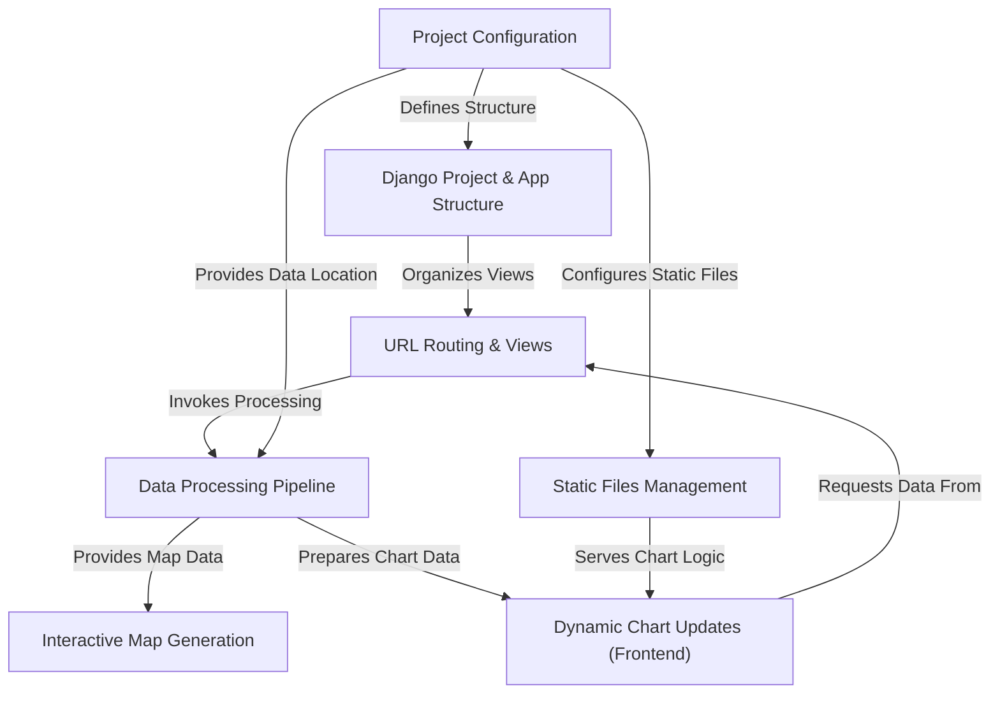

# Tutorial: covid-19-dashboard

This project is a **web-based dashboard** designed to *visualize COVID-19 data* dynamically. It utilizes the Django framework to structure the application and manage web requests. Python libraries are employed to process raw data into usable formats, which are then rendered as *interactive maps* displaying country-level statistics and *dynamic charts* that update in real-time based on user selections.

## Visual Overview

## Chapters

1. [Project Configuration
](01_project_configuration_.md)
2. [Django Project & App Structure
](02_django_project___app_structure_.md)
3. [URL Routing & Views
](03_url_routing___views_.md)
4. [Data Processing Pipeline
](04_data_processing_pipeline_.md)
5. [Static Files Management
](05_static_files_management_.md)
6. [Interactive Map Generation
](06_interactive_map_generation_.md)
7. [Dynamic Chart Updates (Frontend)
](07_dynamic_chart_updates__frontend__.md)

---

